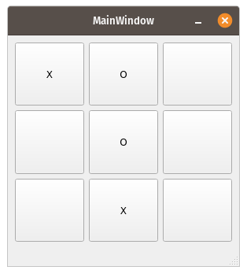

# Tic-Tac-Toe
Simple Tic-Tac-Toe game implemented with Qt

  

 

## Setup

You can compile the source with [Qt Creator](https://www.qt.io/product/development-tools)

## Technologies

* Qt 4

License
----

MPL-2.0 © Samuel Martins
